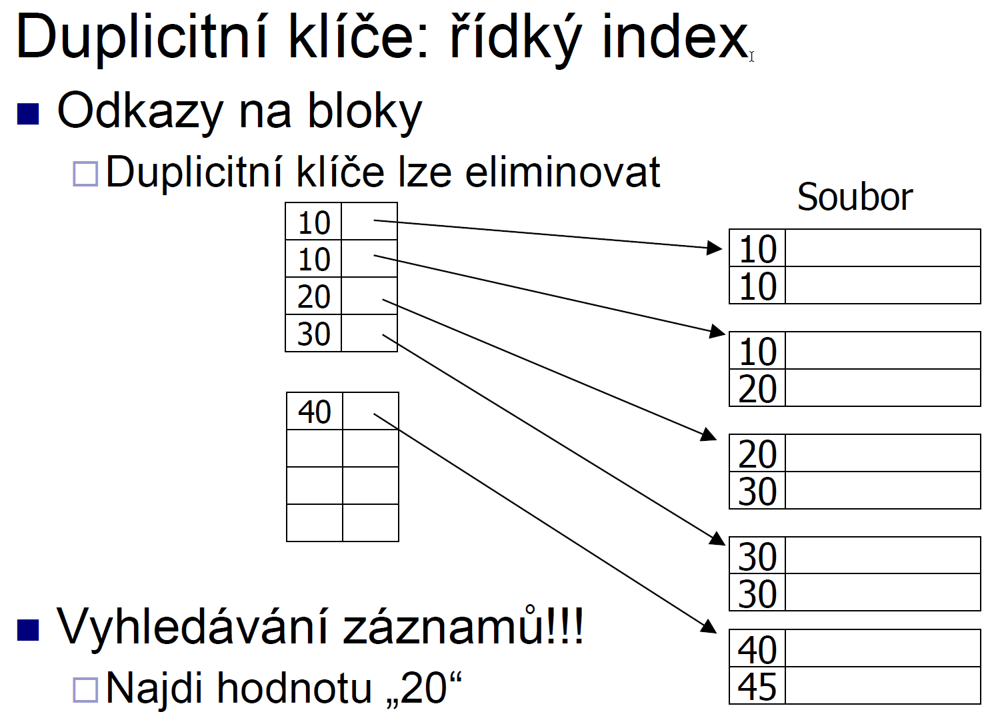
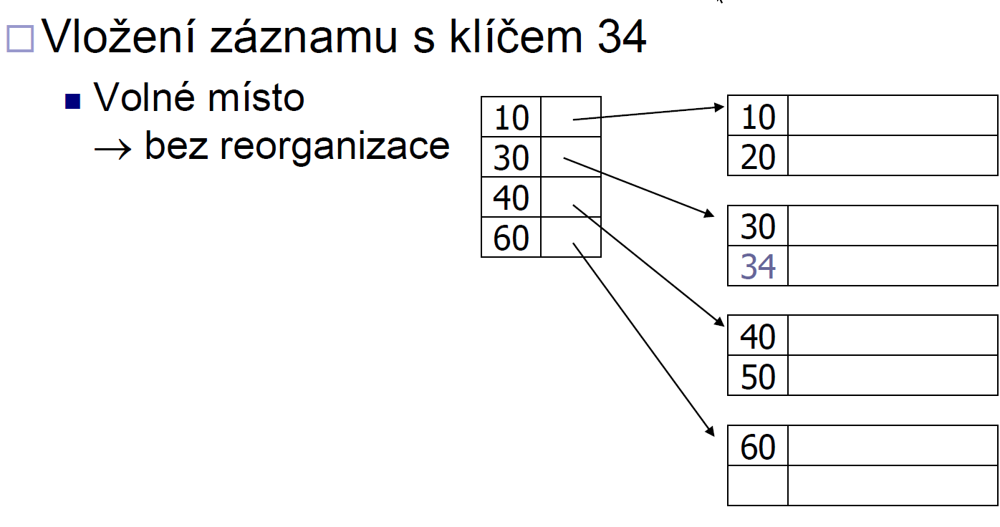
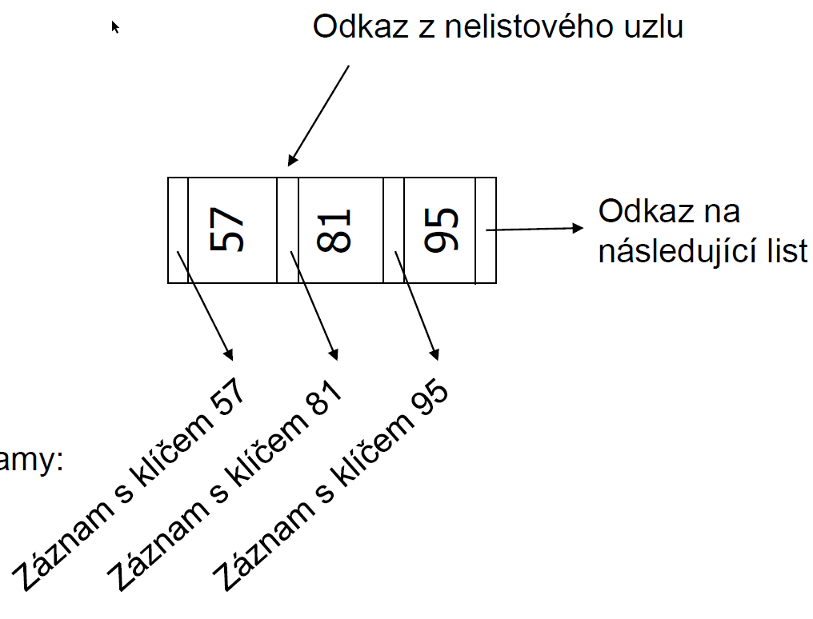

Databáze.

Ukládání dat, adresace záznamů.
Indexování a hašování pro více atributů, bitmapové indexy, dynamické hašování
Vyhodnocení dotazů, transformační pravidla, statistiky a odhady.

Optimalizace dotazů a schématu
Transakční zpracování, výpadky a zotavení.

Podobnostní vyhledávání. 

Databáze

Pouzivame pro efektivni ukladani, vyhledavani a zpracovani dat.

Storage Manager
	správa bloků na disku
	správa vyrovnávací paměti
Query Processor
	překlad dotazu, optimalizace
	vyhodnocení dotazu
Transaction Manager
	atomičnost, izolovanost a trvalost transakcí

DBMS - Database management system - sada nastroju pro ukladani dat

Relační model
  Struktura –data v relacích (tabulkách)
  Operace –dotazování, modifikace
  SQL, relační algebra

## Ukládání dat

### Hiearchie ukladani pameti
Rychle pameti stoji hodne penez, tak mame hiearchii a preklapime z pomalych do rychlych dle potreby

- primarni - cache, RAM
- sekundarni - Disk
- tercialni - zalozni - pasky, opticke disky

Rotacni disk
- pristupova doba(access time) - cas mezi pozadavkem a prenosem dat
  - vystaveni hlavicek
  - rotace disku  
- Atomicka jednotka cteni je sektor/diskovy blok
  - velky blok - amortizace I/O nakaldu, ale cteni vice nepotrebnych dat v okoli
- Sekvencni cteni mnohem rychlejsi nez random pristupy

### DBMS minimalizuje pocet nahodne ctenych bloku
- Defragmentace 
- Planovani pristupu
  - preusporadani pristupu na disk
  - pohyb hlavicky jednim smerem(Jako kdyz sbira lidi vytah, ale jsou i jine pristupy)
- Prefetching

### Diskova pole
- vice disku jako jeden logicky 
- paralelni cteni a zapis
- metody
  - Rozdeleni dat(data striping)
  - Zrcadleni dat (mirroring)

#### zrcadleni
- data ukladana na vic disku a ctena z jednoho z nich
- zvyseni spolehlivosti 
- Data dostupna pri vypadku disku
- Vypadky disku nemusi byt nezavisle(pozar, elektricky zkrat)

#### Rozdeleni dat
- (Jeden blok dat ulozen po castech na ruznych discich)
- Zvyseni prenosove rychlosti
- Paralelizace velkeho cteni
- Vyrovnani zateze - vetsi propustnost
- Vypadky disku nemusi byt nezavisle(pozar, elektricky zkrat)

#### RAID - Redundant Arrays of Independent Disks
Zpusoby rozdeleni dat na discich.
ruzne varianty pro ruzne pozadavky
NENHRAZUJE ZALOHOVANI
- vykonnost 
- spolehlivost
- Kombinace variant

RAID0 - block striping
blok ulozen po castech na vice disku
vysoky vykon, stejne kapacita, nezvysena spolehlivost

RAID1 - Zrcadleni
Kazda disk existuje celkem v n kopiich(Vetsinou n=2)
kapacita 1/n,rychle cteni, zapis jako 1 disk
vysoky vykon, stejne kapacita, nezvysena spolehlivost

RAID5 - data i kontrola parity rozdelena mezi n disku
 
zapis bloku je paralelni, pokud jsou na ruznych discich

Jednotlive varianty lze kombinovat
Nejcasteji kombinace RAID1 nebo RAID5 s RADI0 (RAID1+0,RAID5+0)
 

### Vypadky disku
- Obcasny vypadek pri cteni/zapisu -> opakovani -> ok 
- Vada media
- Zniceni disku -> vymena disku 

detekce - kontrolni soucty 
opravy
- samoopravne kody - Hamming... 
- Stabilni ulozeni
  - ulozeni na vice mistech stejneho disku 
  - Zurnalovani

#### Mean time to failure(MTTF)
Prumerna doba mezi vypadky disku
1 000 000 a vice hodin = polovina disku failne za 114 let = 0.44% za rok = AFR(Anualized failure rate)
MeanTimeTo Repair(MTTR) = Čas od výpadku do obnovení činnosti = čas výměny vadného disku + obnovení dat
MTTDL(Mean time to data loss) - Musi nam vypadnout dalsi disk pri opravovani jineho. Stovky tisic let pro dva zrcadlicic disk s MTTR =3 hodiny

SSD jsou rychlejsi, ale zase maji presny pocet zapisu -> po jiste dobe dojde k uplnemu vypadku, V RAIDu vypadnou vsechny naraz

Správa vyrovnávací paměti
- Nektere bloky je treba nechat v pameti dele(specificke pro db) - Indexy, vyhodnocovani spojeni relaci 
- ruzne strategie - LRU,FIFO

## Adresace zaznamu

uloziste -> datove elementy -> zaznamy -> bloky -> soubory

Zaznam - Seznam souvisejicich hodnot datovych elementu
kazdy element ma svuj typ
- Vetsinou pevna delka 
- Promenliva - delka na zacatku hodnoty

Schema zaznamu
- popisuje strukturu zaznamu 
- Pocet, poradi,typy a nazvy atributu
- promenliva vs pevna delka

 
ulozeni zaznamu do bloku
Bloky pevne velikosti, zaznamy bud pevne nebo promenne
Problemy k reseni:
- oddelovani zaznamu 
  - pevna delka - zadny oddelovac
    - pamatovat pocet + ukazatel na prvni zaznam
  - Promenna delka
    - Ukladani delek zaznamu(v hlavicce bloku)
- rozdelovani/nerozdelovani zaznamu
  - nerozdelovani - kazdy zaznam soucasti jednoho bloku, jednodussi ale muze plytvat mistem
  - rozdelovani - Zaznam preteka mezi bloky, Nutne, pokud je zaznam vetsi nez blok
- usporadani zaznamu
  - zaznamy jsou usporadany dle nejakeho klice = sekvencni soubor
  - efektivni cteni zaznamu v danem poradi (pro merge join, order by)
- odkazy na zaznamy
  - rozdelovani zaznamu 
  - odkazy na zaznamy(indexy)
  - Zretezni bloku(indexy)
 
Adresa zaznamu
- v pameti 
  - prima adresace

- v ulozisti
  - sekvence bajtu popisujichc umisteni	
  - Prima adresace
    - Fyzicka adresa zaznamu v ulozisti - disk, stopa,povrch,blok, offset
    - neprakticke - realkace bloku...
  - neprima adresace
    - zaznam ma sve ID = logicka adresa 
    - prevodni tabulka ID,Fyzicka adresa (map table)
    - zvysene naklady - management tabulky 
    - vetsi flexibilita - mazani,vkladani,optimalizace ulozeni do bloku
     
V realu pouzivane odkazy na zaznamy
adresa zaznamu = ID souboru + číslo bloku + offset v bloku
Uložení bloku určuje systém souborů (file system)
offset v bloku je offset v hlavicce, kde je link na misto v bloku, kde zacina zaznam
 

Hlavička bloku
 - Přítomná v každém bloku
 - File ID (or RELATIONIDor DB ID)
 - Typ bloku - např. záznamy typu 4, přetoková oblast, TOAST záznamy, …
 - IDbloku (tohoto)
 - Adresář záznamů (odkazy na data záznamů)
 - Ukazatel na volné místo (začátek, konec)
 - Ukazatel na další blok (např. pro indexy)
 - Čas modifikace (popř. verze)

Modifikace zaznamu v bloku
- vkladani - snadne
- Mazani - Problemove
- Zmena
  - Stejna velikost - jednoducha 
  - jina velikost - smazani a vlozeni

Mazani zaznamu
- Pointery do smazanych zaznamu musi byt zneplatneny(nesmi odkazovat na jina data) 
- prima adresa zaznamu - na zacatek znacku, ze smazano + oznamit volne misto
- Neprima adresace - map table - znacka ze smazano v tabulce ID|lokace (map, table)
- Adresa záznamu je adr. bloku + offset
 

vkladani zaznamu
-nesekvencni soubor
  - na konec - posledni blok nebo zalozime novy
  - Do volneho mista v existujicim bloku
- usporadany sekvencni soubor
  - Musi byt neprima adresace nebo offset(v halvicce)
  - Ulozit do pretokoveho bloku - odkaz na nej je soucasti hlavicky bloku 

## Indexování a hašování pro více atributů, bitmapové indexy, dynamické hašování

### Indexování 
duvod - rychlejsi pristup k zaznamum nez sekvencni
varianty
  - konvencni indexy 
  - B-stromy
  - Hasovani

Resime primarni klic, dle ktereho jsou serazeny zaznamy v souboru
sekvencni soubor -> index sekvencni soubor
 
sekvencni soubor: zaznamy josu v nem razeny dle nejakeho primarniho klice
Husty vs ridky index
 
 

Ukazatele v indexu mohou ukazovat bud primo na zaznam(blok+offset) nebo na blok(soubor+cislo bloku)
Pokud je soubor spojity a usporadany
  - ukazatele na bloky se nemusi ukladat, lze je spocitat 
  - Cislo bloku lze urcit z poradi polozky v indexu napriklad
  
### Mazani indexu
 
 
 
 
u husteho indexu vzdy update 

### vkladani do ridkeho indexu
pokud se vejde do bloku
 
Pokud ne
 
 

u husteho indexu vkladani vzdy nove hodnoty do indexu, v souboru stejne reseno jako u ridkeho

### Sekundarni index
Soubor vybudovany na jinem klici nez sekundarnim
 
Duplicitni hodnoty klice bude opakujeme nebo lze resit tabulkou
 
Nejcasteji ale vyreseno kybliky[buckets]
 
U kybliku mame po ruce vsechny zaznamy s danou hodnotou, delaji se jednoduse pruniky a sjednoceni nad jednou tabulkou.

Konvencni indexy shrnuti:
ridke vs huste
u vkladani/mazani resime duplicitni klice

jsou jednoduche a index je sekvencni soubor = jednoduchy full scan
Draha katualizace a casem ztrate sekvencnosti a vyvazenosti kvuli pretokovym oblastem

## B-stromy

Neni nutne sekvencni usporadani a garance I/O pro pristup(protoze jsou vyvazene)
vice variant - B,B-,B+...
Obvykle se mysli B-strom = B+-strom
 
listovy uzel
 
vkladani - najit list a vlozit klic
  - bez reorganizace 
  - nebo stepeni list
  - nebo stepeni vntrniho uzlu
  - novy koren
Ma vetsi rezii nez klsicky index ale zase se sam pomalu reorganizue

## Hasovani
Funkce vracejici adresu(v bucketu) pro vstupni klic
Zase se pouzivaji buckety viz vyse. 
Hasovaci funkce by mela byt rovnomerna a nahodna.

kolize - dve vstupni hodnoty funkce jdou na jeden vystup.
       - Neni problem, pokud lze na jedne adrese ulozit vice klicu

Preteceni
  - kapacita kybliku je naplnea 
  - vytvorime pretokovou oblast, kam nove hodnoty dame a link na ni dame do kybliku
preteceni:
 
Kdyz se smaze C, tak se E presune do bloku 1 a pretokova oblast se smaze

### dynamické Hasovani
- rozsirene 
- linearni

#### rozsirene hasovani
Vyuziti pouze nekolika prvnich bit adresy
pridani dalsi tabulkya = adresar
 
pri pridavani zaznamu bud zaznamy padnou do kybliku, nebo se kyblik rozsiri
pokud je adresar plny, tak se musi zvetsit dvakrat(adresace jemnejsi o bit)
Mazani - smaze klic, pokud je kyblik prazdny, muze sloucit sousedni kybliky ci dokonce adresar
vyhody
- efektivni pro menici se data
- Mene plytva mistem nez staticke hasovani
- Reorganizace je lokalni
nevyhody
- dalsi urovanen neprimych odkazu 
- Adresar se zdvojnasobuje, zatimce kybliky/zaznamy rostou linearne

#### linearni hasovani
Vyuziti pouze nekolik poslednich bit adresy, zadny adresar, soubor roste linearne
 
Pokud neni misto, zase pretokova oblast
pri rozsireni souboru prerozdeli zaznamy z pretokovych oblasti
 
vyhody
- performance pro menici se data 
- Mene plytva mistem nez staticke hasovani
- lokalni reorganizace
- Zadna dodatecna prekladova tabulka
nevyhody
- pretokove oblasti

hasovani - vhodne pro select ... where a=5
indexovani - vhodne pro select ... where a>5

### bitmapovy (rastrovy) index
Atribut X ma H unikatnich hodnot - vhodne pro male H
Tabulka, pro kazdou hodnotu bitove pole o delce=pocet zaznamu v tabulce
 
nevyhody
- Pametova narocnost 
- Aktualizace zaznamu
  - nova hodnota - nove bitove pole 
  - Novy zaznam -> rozsireni vsech poli
vyhody
- rychle oprace na bitech(AND,OR) 
- pouzitelne i pro rozsahle dotazy
- Snadna kombinace vice indexu

Komprese - vetisnou v bitovem poli malo 1 hodne 0 - RLE komprese
RLE - rezdeleni na casti, sekvence I nul nasledovana jednickou
I ulozit binarne
kod casti je: "delka binarniho cisla I , vlastni cislo I"

implementace:
- Nalezení bitového pole pro konkrétní hodnotu klíče
  - pro hodnoty klice mame B+-strom a v listu odkaz na bitove pole 
- Mám bitové pole, jak načtu záznamy?
  - sekvencni soubor -> snadne, delka zaznamu\*pozice v bitovem poli 
  - nebo sekundarni index pro cisla zaznamu
- Aktualizace záznamů, co s indexem? (Cisla zaznamu jsou vetsinou fixni)
  - smazani - prepisu na 0 ve vsech polich, nebo mam jedno pole platne/neplatne zaznamy 
  - Vkladani - pridej na konec souboru a do bitoveho pole pripojit 1/0
  - pokud nejsou cisla zaznamu fixni, tak reorganizace vsech poli - nepouziva se

### viceklicovy index
index pro vice atributů: select name WHERE oddělení=‘Hračky’ AND plat < 10000
Řešení
 - Index pro jeden atribut + filtrování
 - Nezávislé indexy pro atributy + průnik vyhovujících
 - Index v indexu - lze dotazy A a B z obrazku
 
 - Spojení klíčů v jeden
   - podobne indexu pro jeden klic - generujem hodnotu klice z atributu(spojeni retezcu, kombinace cisel)
   - prilis se nepouziva v indexovani
   - v hasovani: delena hasovaci funkce(partitioned has function)

Delena hasovaci funkce
dva klice - dve hasovaci funkce - jejich vystup spojim(concat)
 

#### Grid
 
V mrizce odkazy na kyblik
Nutne vymyslet dobre rozdeleni os pro mrizku, aby byla rovnomerne zaplnena

Vyhodnocení dotazů, transformační pravidla, statistiky a odhady.